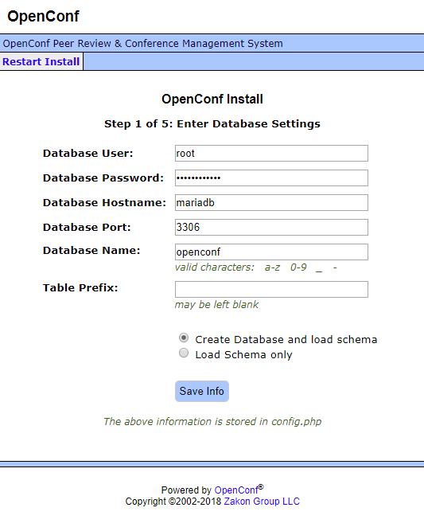

# openconf-docker

[OpenConf](https://www.openconf.com/)の評価時に、dockerizeされたものが見つからなかったので作りました。OpenConfをコンテナベースで配備します。version6.81で動作確認しました。https化の部分は、評価時にそこまでやってないので、動作未確認ですが、タブン動くと思います。

## 用意するもの
- Linuxサーバ
  - 最終的に運用する際には、ドメイン名でアクセスできるようにするのが望ましいでしょう
  - ドメイン名があれば、steveltn/https-portalを使って、httpsで通信できます
- Googleのアカウント、及び、パスワード
  - OpenConfからのメール送信にGoogleのsmtpサーバを使うため
  - アカウントが2段階認証に設定されている場合は、アプリパスワードを用意してください
- docker、及び、docker-composeの知識
  - 本文書で分からない記述が出てきたら、ググってください

## インストール
1. docker、及び、docker-composeが動作するLinuxサーバ上に、本リポジトリをgit cloneします
1. passwd.clientにGoogleのアカウント情報を記入します
1. openconf-6.81.zipをダウンロードしてきて、docker-compose.ymlと同じディレクトリに置きます
1. サーバにドメイン名が付いていて、httpsでアクセスできるようにしたければ、docker-compose-with-https.ymlの、your.site.comを書き換えます
1. httpsで通信できるようにしたい場合、docker-compose-with-https.ymlを使って、httpで構わない場合、docker-compose.ymlを使って、docker-compose up -dで、OpenConfを起動します
1. ブラウザで初回アクセスすると、最初にDBの設定を聞かれます。パスワードはdocker-compose.ymlに記入されたものとなります。docker-compose upの前に、適切なパスワードに書き換えておくことをオススメします

1. 初期設定のStep3で、表示言語の設定ができます。日本語を選べるように、もしくは日本語表示のみに設定しておきます。因みに、chairだけは、言語設定しても、ログイン後の表示が英語になります......

## その他
easychairとだいたい同じ感じかなと思いました。普通にpaper集めるconferenceやるには十分な機能だと思ったので、easychairが使えない事情があって、ドメイン名付きのLinuxサーバが用意できるなら、ちょうど良いかなと思います。

[pkp/ocs](https://github.com/pkp/ocs)との比較も、やった方が良かったのですが、基本的に開発がojsに移ってるポイ雰囲気で、コードの古いphp製品はなー、と思って、今回は触ってません。日本語化もなさそうだし。ただ、pkpの製品は、公式にdockerizeされてるので、とっつきやすさはありますね。
